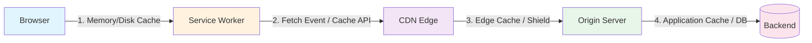

You deployed Friday. Saturday morning the site feels slow. You open DevTools, see `x-cache: MISS`, and start the ritual: purge CDN, invalidate Cloudflare, restart the server, sacrifice a goat to the cache gods. Nothing works. Monday you discover a `Cache-Control: no-store` header you didn't set, buried in a middleware you forgot existed.

Caching is the only system where everyone assumes it works, nobody instruments it, and the failure mode is silent: your users just get a slower experience while you burn budget on origin egress.

This post isn't about configuring cache — it's about *diagnosing* it. We'll build a repeatable CLI-first workflow to answer the only question that matters: "Why wasn't this a hit?" From browser disk cache to CDN edge to your origin response headers, you'll learn to trace a request across every layer using nothing but `curl`, `httpie`, and the headers your platform already emits. No vendor dashboards, no proprietary agents, no "AI-powered insights." Just the raw HTTP conversation and the knobs that actually move the needle.

By the end, you'll have a debug checklist you can run in 60 seconds before you ever open a support ticket — and the config snippets to fix the three most common foot-guns: stale `ETag` collisions, `Vary` header bloat, and the `Cache-Control` directive that silently kills your hit rate.

## The Cache Stack: Where Your Request Actually Goes

Before you can debug a cache miss, you need to know who's holding the keys. Every HTTP request runs a gauntlet of four distinct cache layers, each with its own agenda, its own header vocabulary, and its own way of silently ignoring your carefully crafted `Cache-Control`.



### Layer 1: Browser Cache (Memory & Disk)

Your browser maintains two caches: a fast in-memory store for the current session and a persistent disk cache that survives restarts. Both obey `Cache-Control`, `Expires`, `ETag`, and `Last-Modified` — but *only* for `GET` and `HEAD` responses. `POST` requests never hit browser cache unless you've explicitly configured a service worker to intercept them.

**Quick test:** `curl -I -H "Cache-Control: no-cache" https://example.com/asset.js` — the `no-cache` forces revalidation, but the browser *still* serves from disk if the response is fresh. That's not a bug; it's the spec.

### Layer 2: Service Worker

If you've registered a SW, it sits *between* the browser cache and the network. It can serve from its own `Cache API` storage, synthesize responses, or forward to the network. It respects *nothing* by default — you write the logic. The headers that matter here are whatever your `fetch` handler decides to honor.

```bash
# Check if a SW controls the page
curl -I https://example.com/ | grep -i service-worker
# Returns nothing? No SW. Returns headers? Inspect sw.js
```

### Layer 3: CDN Edge

Cloudflare, Fastly, CloudFront, Bunny — they all implement RFC 9111 (HTTP Caching) with vendor extensions. The headers they *actually* respect:

| Header | CDN Behavior |
|--------|--------------|
| `Cache-Control: public, max-age=31536000, immutable` | Gold standard — long-term cache, no revalidation |
| `Cache-Control: s-maxage=600` | CDN-only TTL, browser ignores it |
| `Vary: Accept-Encoding` | Required for brotli/gzip variants |
| `Vary: Cookie` | **Kills cache** for authenticated users — use sparingly |
| `Surrogate-Control` / `CDN-Cache-Control` | Vendor-specific overrides (Cloudflare, Fastly) |
| `x-cache: HIT/MISS/BYPASS` | Debug header — *always* emitted by major CDNs |

### Layer 4: Your Origin

This is where `Cache-Control` is *generated*. Your framework (Next.js, NestJS, Django, Go) sets headers based on route config, middleware, or explicit response objects. A single forgotten `res.setHeader('Cache-Control', 'no-store')` in a logging middleware poisons every downstream layer.

**Header authority table — who wins where:**

| Header | Browser | Service Worker | CDN | Origin |
|--------|---------|----------------|-----|--------|
| `Cache-Control: max-age` | ✅ | ⚠️ Your code | ✅ | ✅ Source |
| `Cache-Control: s-maxage` | ❌ | ⚠️ Your code | ✅ | ✅ Source |
| `Cache-Control: no-store` | ✅ | ⚠️ Your code | ✅ | ✅ Source |
| `ETag` / `If-None-Match` | ✅ | ⚠️ Your code | ✅ | ✅ Source |
| `Vary` | ✅ | ⚠️ Your code | ✅ | ✅ Source |
| `Surrogate-Control` | ❌ | ❌ | ✅ | ✅ Source |
| `Cache-Tag` (purge) | ❌ | ❌ | ✅ | ✅ Source |

The pattern: browser and CDN follow standards; service worker follows *you*; origin *writes* the rules. Your debug job is verifying the rules survive the journey intact.

Next: we'll build the CLI toolkit to interrogate each layer without leaving your terminal.

## CLI First: Interrogating the Origin Before the Edge

Your CDN lies. Not maliciously — it just has a different definition of "fresh" than you do. Before you waste an hour debugging Cloudflare's cache analytics, you need the ground truth: what your origin *actually* sent. Bypass the edge entirely.

```bash
curl -I -H "Host: lacorte.dev" http://origin-ip:8080/articles/debugging-cache
```

The `-I` flag sends a `HEAD` request — same headers, no body, no wasted bandwidth. The `Host` header matters: if your origin serves multiple domains (hello, virtual hosts), skipping it returns the default vhost's headers, which are useless. I learned this the hard way on a Hetzner box where `curl -I http://1.2.3.4` cheerfully returned `Cache-Control: no-cache` from a health-check endpoint while the real app served `public, max-age=3600`.

Prefer `httpie` for readability? Same data, prettier output:

```bash
http --print=Hh GET http://origin-ip:8080/articles/debugging-cache Host:lacorte.dev
```

`--print=Hh` shows request headers (`H`) and response headers (`h`). Skip the body, skip the noise.

Now isolate the five headers that dictate cache behavior:

```bash
curl -sI -H "Host: lacorte.dev" http://origin-ip:8080/articles/debugging-cache \
  | grep -iE '^(cache-control|etag|last-modified|vary|age):'
```

Typical honest origin response:

```http
cache-control: public, max-age=60, stale-while-revalidate=30
etag: W/"abc123-deadbeef"
last-modified: Tue, 15 Oct 2024 14:22:11 GMT
vary: Accept-Encoding
age: 0
```

**`Age: 0` is your baseline truth.** The origin *just generated* this response. Any `Age > 0` at the edge means the CDN served a stored copy — and the value tells you exactly how many seconds it's been sitting there. If your origin ever returns `Age: 300`, something upstream (a reverse proxy, a misconfigured nginx `proxy_cache`) is already caching before the CDN sees it. Fix that first.

`Cache-Control` directives are your contract. `public` means "any cache may store this." `private` means "browser only — CDN, hands off." `no-store` means "nobody stores this, ever." `max-age` is seconds; `s-maxage` overrides it *only* for shared caches (CDNs). `stale-while-revalidate` and `stale-if-error` are your safety nets — they let the edge serve stale content while revalidating in the background, or when the origin is down.

`ETag` and `Last-Modified` are validators. The `W/` prefix on `ETag` means *weak* validation — semantically equivalent, not byte-for-byte identical. Weak tags are fine for HTML; they break if you're caching binary assets and the CDN does range requests.

`Vary: Accept-Encoding` is correct: it tells caches to store separate entries for gzip, brotli, and identity. `Vary: User-Agent` is a foot-gun — every distinct UA string gets its own cache key. I've seen `Vary: Cookie` on a public blog because a middleware blindly added it. That killed the hit rate instantly.

Run this against *every* route type: static assets, API endpoints, HTML pages. Save the output. That's your source-of-truth document. When the CDN behaves differently, you'll know exactly which header the edge ignored, mutated, or invented.

## Reading the CDN's Mind: Decoding `x-cache`, `cf-cache-status`, and Vercel's Cache Reason

Your CDN isn't a black box — it's a chatty Cathy if you know which headers to read. Every major edge platform emits diagnostic headers, but they speak different dialects. Here's your translation layer.

### Cloudflare: `cf-cache-status`

Cloudflare's header is the most verbose of the bunch. Hit it with a clean request:

```bash
curl -sI -H "Host: lacorte.dev" https://lacorte.dev/ | grep -i cf-cache
```

You'll see one of these:

```
cf-cache-status: HIT          # Served from edge, fresh
cf-cache-status: MISS         # Not in cache, fetched origin
cf-cache-status: EXPIRED      # Was cached, TTL expired, revalidated
cf-cache-status: STALE        # Served stale while revalidating (if enabled)
cf-cache-status: BYPASS       # Cache disabled by rule or header
cf-cache-status: REVALIDATED  # Conditional request, 304 from origin
cf-cache-status: DYNAMIC      # Not cacheable (no-store, private, etc.)
```

The `cf-ray` header gives you the edge colo and request ID — useful when support asks "which POP?" Pro tip: `cf-cache-status: EXPIRED` with a quick follow-up `HIT` means your `Cache-Control: max-age` is too short for the traffic pattern.

### Vercel: `x-vercel-cache` + `Cache Reason`

Vercel added `Cache Reason` in 2024 and it's the first header that tells you *why*, not just *what*. Run:

```bash
curl -sI https://lacorte.dev/ | grep -iE 'x-vercel-cache|cache-reason'
```

Output looks like:

```
x-vercel-cache: HIT
cache-reason: max-age
```

Or the painful version:

```
x-vercel-cache: MISS
cache-reason: query-string
```

`Cache Reason` values you'll actually encounter:

| Reason | Translation |
|--------|-------------|
| `max-age` | Fresh per `Cache-Control: max-age` |
| `stale-while-revalidate` | Served stale, background refresh |
| `query-string` | Query params not in `ignoreQuery` config |
| `cookie` | Request had cookies, page not marked `public` |
| `no-store` | Origin sent `Cache-Control: no-store` |
| `private` | Origin sent `Cache-Control: private` |
| `authorization` | `Authorization` header present |
| `range` | Range request (partial content) |

I once spent two hours wondering why my blog posts weren't caching. `cache-reason: query-string` — Vercel's default `ignoreQuery` only ignores `utm_*` and `fbclid`. My internal search used `?q=term`. Fixed in `vercel.json`:

```json
{
  "headers": [
    {
      "source": "/blog/(.*)",
      "headers": [
        { "key": "Cache-Control", "value": "public, max-age=3600, stale-while-revalidate=86400" }
      ]
    }
  ],
  "ignoreQuery": ["q", "page", "sort"]
}
```

### Fastly: `x-cache` + `x-cache-hits`

Fastly keeps it simple but useful:

```bash
curl -sI https://lacorte.dev/ | grep -iE 'x-cache|x-cache-hits'
```

```
x-cache: HIT, HIT
x-cache-hits: 3, 12
```

Two values = shield POP + edge POP. `x-cache-hits` increments per layer. If you see `MISS, HIT`, your shield node cached it but edge didn't — usually a `Vary` mismatch.

### CloudFront: `x-cache` + `x-amz-cf-pop`

AWS is terse:

```bash
curl -sI https://d123.cloudfront.net/ | grep -iE 'x-cache|x-amz-cf-pop'
```

```
x-cache: Miss from cloudfront
x-amz-cf-pop: FRA50-C1
```

`Hit from cloudfront` means edge hit. `RefreshHit from cloudfront` means stale-while-revalidate served. The POP code tells you which edge — handy when debugging regional cache inconsistency.

### The Universal Debug One-Liner

Stick this in your `.bashrc` or `.zshrc`:

```bash
cdn-debug() {
  curl -sI -H "Host: ${2:-$(echo $1 | cut -d/ -f3)}" "$1" \
    | grep -iE 'cf-cache-status|x-vercel-cache|cache-reason|x-cache|x-cache-hits|x-amz-cf-pop|age|cache-control|etag|vary'
}
```

Usage: `cdn-debug https://lacorte.dev/blog/stop-guessing`. Now you speak every CDN's language without leaving the terminal.

## The Three Silent Killers: Config Patterns That Murder Hit Rates

You've traced the headers. You've cursed the CDN. Now meet the three lines of config that quietly turn a 95% hit rate into a rounding error. Each one looks reasonable in isolation. Each one passes code review. Each one costs you real money.

### 1. The `Vary` Explosion: `Vary: Accept-Encoding, User-Agent, Cookie`

Your origin emits this because some middleware helpfully added `User-Agent` and `Cookie` to `Vary` "for correctness." Now every unique browser/cookie combo gets its own cache key. One CSS file becomes 500 entries. The CDN evicts hot assets to store cold variants. Your hit rate flatlines.

**Diagnose it:**
```bash
curl -sI https://lacorte.dev/styles.css | grep -i vary
# vary: Accept-Encoding, User-Agent, Cookie
```

**Fix it (nginx):**
```nginx
# Delete the noise, keep only what matters
proxy_hide_header Vary;
add_header Vary "Accept-Encoding" always;
```

**Fix it (Cloudflare Workers / Vercel Edge):**
```js
// Strip Vary entirely, rebuild minimally
const resp = await fetch(request)
const headers = new Headers(resp.headers)
headers.delete('vary')
headers.set('vary', 'Accept-Encoding')
return new Response(resp.body, { headers })
```

One line. `Vary: Accept-Encoding` is the only valid value for static assets. `User-Agent` varies are a relic of 2005 WAP detection. `Cookie` varies belong on *authenticated* HTML only — never on `/assets/*`.

---

### 2. The `ETag` Lottery: Filesystem `mtime` Across Container Restarts

Your Node/Go/Python app runs in a container. The framework generates `ETag: W/"<mtime>-<size>"` from the filesystem. You deploy. The container restarts. The file `mtime` changes (Docker layer copy, `COPY` timestamp, CI artifact extract). Every asset gets a new `ETag`. Every conditional `If-None-Match` request becomes a `200 OK` with full body. Your "304 Not Modified" rate drops to zero.

**Diagnose it:**
```bash
# First request
curl -sI https://lacorte.dev/app.js | grep -i etag
# etag: W/"1704067200-12345"

# Deploy, then request again
curl -sI https://lacorte.dev/app.js | grep -i etag
# etag: W/"1704153600-12345"  <- mtime changed, size same
```

**Fix it (any static server):**
```nginx
# nginx: use content hash, not mtime
etag on;              # default, but uses mtime
# Instead, precompute at build:
# echo -n "$(sha256sum app.js | cut -d' ' -f1)" > app.js.etag
# Then serve via custom header or immutable Cache-Control
```

**Fix it (application code — one liner):**
```python
# Python/Flask/FastAPI: stable ETag from content hash
import hashlib
etag = hashlib.sha256(content).hexdigest()[:16]
response.headers["ETag"] = f'W/"{etag}"'
```

Stable `ETag` = stable `304`. Deploy all you want. The header only changes when *content* changes.

---

### 3. The `max-age=0` Trap: `Cache-Control: max-age=0, must-revalidate`

You see `max-age=0` and think "uncached." The spec says: "the response is stale immediately, but *can* be served stale on error." Your CDN reads this as "revalidate every request" — which it does, adding latency. But if origin hiccups, the CDN *still serves stale* because `must-revalidate` only blocks stale on *successful* revalidation failure. You get the worst of both worlds: origin hammered on every request, *and* stale content during outages.

**Diagnose it:**
```bash
curl -sI https://lacorte.dev/api/user | grep -i cache-control
# cache-control: max-age=0, must-revalidate
```

**Fix it (pick one, not both):**

Actually uncacheable — no stale, no store:
```nginx
add_header Cache-Control "no-store, private" always;
```

Stale-while-revalidate — fast hits, background refresh:
```nginx
add_header Cache-Control "max-age=60, stale-while-revalidate=300" always;
```

The second line is the one you want for 90% of "dynamic" endpoints. `max-age=0, must-revalidate` is a lie you tell yourself. Stop telling it.

---

Three greps. Three one-line fixes. Your hit rate chart will thank you Monday morning.

## Automate the Check: A `cache-audit` Script You Can Drop in CI

You've manually traced headers. You've found the `Vary: User-Agent` that turned your cache into a snowflake factory. Now automate the part where you remember to check next week. Here's a single-file Python script that lives in `scripts/cache-audit.py`, runs in CI, and fails the build when your hit rate drops or a `no-store` sneaks into production. Zero dependencies — just the stdlib you already trust.

```python
#!/usr/bin/env python3
"""
cache-audit.py — Assert your cache headers haven't regressed.
Usage:
  python cache-audit.py urls.txt --expect-hit-rate 0.9
  python cache-audit.py https://api.example.com/health --origin-only --follow-redirects
Exit codes: 0 = pass, 1 = header assertion failed, 2 = network error, 3 = usage error
"""
import argparse
import sys
import urllib.request
import urllib.error
import re
from dataclasses import dataclass
from typing import List, Optional

@dataclass
class AuditResult:
    url: str
    status: int
    cache_status: Optional[str]
    cache_control: Optional[str]
    vary: Optional[str]
    etag: Optional[str]
    is_hit: bool
    errors: List[str]

def parse_args() -> argparse.Namespace:
    p = argparse.ArgumentParser(description="Audit cache headers across a URL list")
    p.add_argument("urls", nargs="+", help="URLs to audit, or a file with one URL per line")
    p.add_argument("--origin-only", action="store_true", help="Bypass CDN: add Host header, skip edge")
    p.add_argument("--follow-redirects", action="store_true", help="Follow 3xx (default: false)")
    p.add_argument("--expect-hit-rate", type=float, help="Fail if hit rate < threshold (0.0-1.0)")
    p.add_argument("--timeout", type=int, default=10, help="Request timeout seconds")
    return p.parse_args()

def load_urls(args: argparse.Namespace) -> List[str]:
    urls = []
    for u in args.urls:
        if u.endswith(".txt") or u.endswith(".list"):
            with open(u) as f:
                urls.extend([line.strip() for line in f if line.strip() and not line.startswith("#")])
        else:
            urls.append(u)
    return urls

def fetch(url: str, origin_only: bool, follow_redirects: bool, timeout: int) -> AuditResult:
    req = urllib.request.Request(url, method="HEAD")
    if origin_only:
        # Assume you pass --origin-only with a Host header pointing to your origin IP
        # In CI, set ORIGIN_HOST=api.internal and ORIGIN_IP=10.0.0.5
        import os
        if host := os.getenv("ORIGIN_HOST"):
            req.add_header("Host", host)
    opener = urllib.request.build_opener()
    if not follow_redirects:
        opener.add_handler(urllib.request.HTTPRedirectHandler())
    errors = []
    try:
        with opener.open(req, timeout=timeout) as resp:
            headers = resp.headers
            status = resp.status
    except urllib.error.HTTPError as e:
        return AuditResult(url, e.code, None, None, None, None, False, [f"HTTP {e.code}: {e.reason}"])
    except Exception as e:
        return AuditResult(url, 0, None, None, None, None, False, [f"Network error: {e}"])

    cache_control = headers.get("Cache-Control")
    vary = headers.get("Vary")
    etag = headers.get("ETag")
    # CDN-specific hit/miss headers
    cache_status = (
        headers.get("CF-Cache-Status")
        or headers.get("X-Cache")
        or headers.get("X-Vercel-Cache")
        or headers.get("Age")  # Age > 0 implies hit somewhere
    )
    is_hit = False
    if cache_status:
        cache_status = cache_status.upper()
        is_hit = "HIT" in cache_status or (cache_status == "AGE" and headers.get("Age", "0") != "0")
    elif headers.get("Age", "0") != "0":
        is_hit = True
        cache_status = "AGE"

    # Assertions
    if cache_control and "no-store" in cache_control.lower():
        errors.append("Cache-Control contains no-store")
    if vary and len(vary.split(",")) > 3:
        errors.append(f"Vary header has {len(vary.split(','))} values (bloat risk)")
    if etag and etag.startswith('W/"') and not origin_only:
        errors.append("Weak ETag at edge — may prevent CDN revalidation")

    return AuditResult(url, status, cache_status, cache_control, vary, etag, is_hit, errors)

def main() -> int:
    args = parse_args()
    urls = load_urls(args)
    if not urls:
        print("No URLs provided", file=sys.stderr)
        return 3

    results = []
    for url in urls:
        r = fetch(url, args.origin_only, args.follow_redirects, args.timeout)
        results.append(r)
        status_icon = "✓" if not r.errors else "✗"
        hit_icon = "HIT" if r.is_hit else "MISS"
        print(f"{status_icon} {url} [{r.status}] {hit_icon} {r.cache_status or '-'}")
        for err in r.errors:
            print(f"   ↳ {err}")

    if args.expect_hit_rate is not None:
        hits = sum(1 for r in results if r.is_hit)
        rate = hits / len(results) if results else 0
        if rate < args.expect_hit_rate:
            print(f"\nFAIL: Hit rate {rate:.1%} < expected {args.expect_hit_rate:.1%}", file=sys.stderr)
            return 1

    if any(r.errors for r in results):
        return 1
    return 0

if __name__ == "__main__":
    sys.exit(main())
```

Drop this in `scripts/`, `chmod +x` it, and add a CI step:

```yaml
# .github/workflows/cache-audit.yml
- name: Audit cache headers
  run: |
    ORIGIN_HOST=api.myapp.com ORIGIN_IP=10.0.0.5 \
    python scripts/cache-audit.py urls.txt --expect-hit-rate 0.9 --origin-only
```

The `urls.txt` is just a newline-delimited list — commit it alongside your deploy config. Now when a junior dev adds `Vary: Cookie` to the auth middleware, the build fails before it hits staging. You fixed the leak once; the script makes sure it stays fixed.

## When the Edge Lies: Validating Purge and Invalidation Actually Worked

You clicked "Purge Everything" in the dashboard. The spinner spun. The toast notification glowed green. You feel good. You are wrong.

Dashboards report *intent*, not *reality*. A purge API call returns `200 OK` the moment it's accepted — not when the last POP evicts the object. I've watched Cloudflare report "purged" while `x-cache: HIT` persisted in Frankfurt for another 90 seconds. Vercel's "instant cache invalidation" is instant per-region, not instant global. Your users in Singapore are still eating stale HTML while you're high-fiving the deploy.

Trust headers. Not toasts.

### The Purge Verification Protocol

Three signals confirm a purge actually propagated:

1. **`Age` resets to `0`** — The object was evicted; the next response is fresh from origin.
2. **`x-cache` (or `cf-cache-status`, `x-vercel-cache`) flips `MISS` → `HIT`** — First request after purge is a miss (origin hit), second is a hit (edge cached the fresh copy).
3. **Your origin access logs show the revalidation request** — If the edge still has a stale copy, it serves it silently. A real purge forces a forward request.

Run this sequence immediately after triggering a purge. Replace the URL with your actual asset:

```bash
# 1. Prime the pump — get a baseline HIT (if cached)
curl -sI "https://lacorte.dev/assets/main.css" | grep -iE '^(age|x-cache|cf-cache-status|x-vercel-cache):'

# 2. Trigger purge (API, CLI, or dashboard — your call)
#    Example for Cloudflare zone purge:
#    curl -X POST "https://api.cloudflare.com/client/v4/zones/$ZONE_ID/purge_cache" \
#      -H "Authorization: Bearer $CF_TOKEN" -H "Content-Type: application/json" \
#      -d '{"purge_everything":true}'

# 3. Wait 2s, then hammer the verification loop
for i in {1..10}; do
  echo "=== Attempt $i ==="
  curl -sI "https://lacorte.dev/assets/main.css" \
    | grep -iE '^(age|x-cache|cf-cache-status|x-vercel-cache|date):'
  sleep 2
done
```

Watch for the pattern:

```
=== Attempt 1 ===
age: 0
cf-cache-status: MISS
x-cache: MISS
date: Sat, 15 Mar 2025 10:00:02 GMT

=== Attempt 2 ===
age: 0
cf-cache-status: HIT
x-cache: HIT
date: Sat, 15 Mar 2025 10:00:04 GMT
```

`Age: 0` on the first response proves the edge fetched from origin. The flip to `HIT` on the second proves it cached the fresh copy. If you see `Age: 342` and `HIT` on attempt 1 — the purge hasn't reached that POP yet.

### Monitor Propagation Across POPs with `watch`

Single-request checks lie. You need to see *which* edge nodes are still stale. Use `watch` with a geographic DNS resolver to sample multiple POPs from your laptop:

```bash
watch -n 3 'for resolver in 1.1.1.1 8.8.8.8 9.9.9.9 208.67.222.222; do
  echo "--- Via $resolver ---"
  curl -sI --dns-servers $resolver "https://lacorte.dev/assets/main.css" \
    | grep -iE "^(age|cf-cache-status|x-cache):"
done'
```

Each resolver tends to hit different POPs (Cloudflare, Google, Quad9, OpenDNS). You'll see `MISS`/`Age: 0` propagate across the grid over 30–120 seconds. When all four show `HIT` with `Age > 0`, the purge is global.

### Verify Origin Saw the Request

The ultimate truth lives in your origin logs. Tail them during the purge:

```bash
# If you're on a container/VM with journalctl:
journalctl -u nginx -f | grep "main.css"

# Or if logs go to a file:
tail -f /var/log/nginx/access.log | grep "main.css"
```

You should see exactly **one** request for that asset after the purge — the revalidation fetch. Zero requests means the edge served stale (purge failed). More than one means multiple POPs fetched independently (normal) or a thundering herd (add `Cache-Control: stale-while-revalidate` to smooth it).

### The "Soft Purge" Trap

Some platforms (Cloudflare Enterprise, Fastly) support "soft purge" — marking content stale but serving it while revalidating asynchronously. Your `cf-cache-status` stays `HIT`, `Age` keeps climbing, but `Server-Timing: cdn-cache; desc=STALE` appears. Dashboard says "purged." Users get stale content. Origin sees *zero* requests until the background fetch completes.

Fix: always purge with `"purge_everything": true` or tag-based hard purge. Soft purge is for "I'll update this blog post in 5 minutes, it's fine if someone sees the old version for 30 seconds." It is not for "I just deployed a security fix."

---

**Checklist for every deploy:**
- [ ] Purge triggered via API (script it, don't click)
- [ ] `watch` loop shows `MISS` → `HIT` + `Age: 0` across 3+ resolvers
- [ ] Origin logs show exactly one revalidation request per asset
- [ ] No `STALE` or `REVALIDATED` timing headers on subsequent loads

If any check fails, the purge didn't work. The dashboard is gaslighting you.
