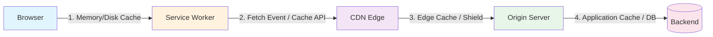

Você fez deploy na sexta. Sábado de manhã o site parece lento. Abre o DevTools, vê `x-cache: MISS`, e começa o ritual: purge no CDN, invalida o Cloudflare, reinicia o servidor, acende uma vela para os deuses do cache. Nada funciona. Segunda você descobre um header `Cache-Control: no-store` que você não configurou, enterrado num middleware que você tinha esquecido que existia.

Cache é o único sistema em que todo mundo assume que funciona, ninguém instrumenta, e o modo de falha é silencioso: seus usuários só recebem uma experiência mais lenta enquanto você queima orçamento em egress da origem.

Este post não é sobre configurar cache — é sobre *diagnosticar*. Vamos montar um fluxo repetível, CLI-first, para responder a única pergunta que importa: "Por que isso não foi um hit?" Do cache em disco do navegador à borda do CDN até os headers de resposta da sua origem, você vai aprender a rastrear uma requisição em cada camada usando só `curl`, `httpie` e os headers que sua plataforma já emite. Sem dashboards de vendor, sem agentes proprietários, sem "insights com IA." Só a conversa HTTP crua e os controles que realmente fazem diferença.

No final, você terá uma checklist de debug que roda em 60 segundos antes de abrir um ticket de suporte — e os snippets de config para corrigir as três armadilhas mais comuns: colisões de `ETag` obsoleto, inchaço do header `Vary`, e a diretiva `Cache-Control` que mata silenciosamente sua taxa de acerto.

## A Stack de Cache: Por Onde Sua Requisição Realmente Passa

Antes de depurar um cache miss, você precisa saber quem está com as chaves. Toda requisição HTTP passa por um corredor de quatro camadas de cache distintas, cada uma com sua própria agenda, seu próprio vocabulário de headers, e sua própria forma de ignorar silenciosamente o `Cache-Control` que você elaborou com cuidado.



### Camada 1: Cache do Navegador (Memória e Disco)

Seu navegador mantém dois caches: um store rápido em memória para a sessão atual e um cache persistente em disco que sobrevive a reinicializações. Ambos obedecem `Cache-Control`, `Expires`, `ETag` e `Last-Modified` — mas *somente* para respostas `GET` e `HEAD`. Requisições `POST` nunca entram no cache do navegador, a menos que você tenha configurado explicitamente um service worker para interceptá-las.

**Teste rápido:** `curl -I -H "Cache-Control: no-cache" https://example.com/asset.js` — o `no-cache` força revalidação, mas o navegador *ainda* serve do disco se a resposta estiver fresca. Isso não é bug; é a spec.

### Camada 2: Service Worker

Se você registrou um SW, ele fica *entre* o cache do navegador e a rede. Pode servir do próprio storage da `Cache API`, sintetizar respostas ou encaminhar para a rede. Por padrão, não respeita *nada* — você escreve a lógica. Os headers que importam aqui são os que o seu handler de `fetch` decide honrar.

```bash
# Check if a SW controls the page
curl -I https://example.com/ | grep -i service-worker
# Returns nothing? No SW. Returns headers? Inspect sw.js
```

### Camada 3: Borda do CDN

Cloudflare, Fastly, CloudFront, Bunny — todos implementam RFC 9111 (HTTP Caching) com extensões de vendor. Os headers que eles *realmente* respeitam:

| Header | CDN Behavior |
|--------|--------------|
| `Cache-Control: public, max-age=31536000, immutable` | Gold standard — long-term cache, no revalidation |
| `Cache-Control: s-maxage=600` | CDN-only TTL, browser ignores it |
| `Vary: Accept-Encoding` | Required for brotli/gzip variants |
| `Vary: Cookie` | **Kills cache** for authenticated users — use sparingly |
| `Surrogate-Control` / `CDN-Cache-Control` | Vendor-specific overrides (Cloudflare, Fastly) |
| `x-cache: HIT/MISS/BYPASS` | Debug header — *always* emitted by major CDNs |

### Camada 4: Sua Origem

É aqui que o `Cache-Control` é *gerado*. Seu framework (Next.js, NestJS, Django, Go) define headers com base em config de rota, middleware ou objetos de resposta explícitos. Um único `res.setHeader('Cache-Control', 'no-store')` esquecido num middleware de logging envenena todas as camadas abaixo.

**Tabela de autoridade de headers — quem manda em cada camada:**

| Header | Browser | Service Worker | CDN | Origin |
|--------|---------|----------------|-----|--------|
| `Cache-Control: max-age` | ✅ | ⚠️ Your code | ✅ | ✅ Source |
| `Cache-Control: s-maxage` | ❌ | ⚠️ Your code | ✅ | ✅ Source |
| `Cache-Control: no-store` | ✅ | ⚠️ Your code | ✅ | ✅ Source |
| `ETag` / `If-None-Match` | ✅ | ⚠️ Your code | ✅ | ✅ Source |
| `Vary` | ✅ | ⚠️ Your code | ✅ | ✅ Source |
| `Surrogate-Control` | ❌ | ❌ | ✅ | ✅ Source |
| `Cache-Tag` (purge) | ❌ | ❌ | ✅ | ✅ Source |

O padrão: navegador e CDN seguem os padrões; service worker segue *você*; origem *escreve* as regras. Seu trabalho de debug é verificar se as regras sobrevivem intactas à jornada.

A seguir: montamos o kit CLI para interrogar cada camada sem sair do terminal.

## CLI First: Interrogando a Origem Antes da Borda

Seu CDN mente. Não de propósito — ele só tem uma definição diferente de "fresco" da sua. Antes de perder uma hora depurando analytics de cache do Cloudflare, você precisa da verdade absoluta: o que sua origem *realmente* enviou. Contorne a borda por completo.

```bash
curl -I -H "Host: lacorte.dev" http://origin-ip:8080/articles/debugging-cache
```

A flag `-I` envia uma requisição `HEAD` — mesmos headers, sem body, sem desperdiçar banda. O header `Host` importa: se sua origem serve múltiplos domínios (olá, virtual hosts), pular ele retorna os headers do vhost padrão, que são inúteis. Aprendi isso da pior forma num box Hetzner onde `curl -I http://1.2.3.4` retornava alegremente `Cache-Control: no-cache` de um endpoint de health-check enquanto o app real servia `public, max-age=3600`.

Prefere `httpie` pela legibilidade? Mesmos dados, saída mais bonita:

```bash
http --print=Hh GET http://origin-ip:8080/articles/debugging-cache Host:lacorte.dev
```

`--print=Hh` mostra headers de requisição (`H`) e de resposta (`h`). Pula o body, pula o ruído.

Agora isole os cinco headers que ditam o comportamento de cache:

```bash
curl -sI -H "Host: lacorte.dev" http://origin-ip:8080/articles/debugging-cache \
  | grep -iE '^(cache-control|etag|last-modified|vary|age):'
```

Resposta típica de uma origem honesta:

```http
cache-control: public, max-age=60, stale-while-revalidate=30
etag: W/"abc123-deadbeef"
last-modified: Tue, 15 Oct 2024 14:22:11 GMT
vary: Accept-Encoding
age: 0
```

**`Age: 0` é sua linha de base da verdade.** A origem *acabou de gerar* essa resposta. Qualquer `Age > 0` na borda significa que o CDN serviu uma cópia armazenada — e o valor diz exatamente quantos segundos ela está lá parada. Se sua origem algum dia retornar `Age: 300`, algo upstream (um reverse proxy, um nginx `proxy_cache` mal configurado) já está cacheando antes do CDN ver. Corrija isso primeiro.

As diretivas de `Cache-Control` são seu contrato. `public` significa "qualquer cache pode armazenar isso." `private` significa "só navegador — CDN, fica fora." `no-store` significa "ninguém armazena isso, nunca." `max-age` é em segundos; `s-maxage` sobrescreve *somente* para caches compartilhados (CDNs). `stale-while-revalidate` e `stale-if-error` são suas redes de segurança — permitem que a borda sirva conteúdo obsoleto enquanto revalida em background, ou quando a origem está fora.

`ETag` e `Last-Modified` são validadores. O prefixo `W/` no `ETag` significa validação *fraca* — semanticamente equivalente, não byte a byte idêntico. Tags fracas funcionam bem para HTML; quebram se você está cacheando assets binários e o CDN faz range requests.

`Vary: Accept-Encoding` está correto: diz aos caches para armazenar entradas separadas para gzip, brotli e identity. `Vary: User-Agent` é uma armadilha — cada string de UA distinta ganha sua própria chave de cache. Já vi `Vary: Cookie` num blog público porque um middleware adicionou cegamente. Isso matou a taxa de acerto na hora.

Rode isso contra *cada* tipo de rota: assets estáticos, endpoints de API, páginas HTML. Salve a saída. Esse é seu documento fonte da verdade. Quando o CDN se comportar diferente, você saberá exatamente qual header a borda ignorou, mutou ou inventou.

## Lendo a Mente do CDN: Decodificando `x-cache`, `cf-cache-status` e o Cache Reason da Vercel

Seu CDN não é uma caixa preta — ele fala bastante se você souber quais headers ler. Toda plataforma de borda relevante emite headers de diagnóstico, mas falam dialetos diferentes. Aqui está sua camada de tradução.

### Cloudflare: `cf-cache-status`

O header do Cloudflare é o mais verboso do grupo. Acerte com uma requisição limpa:

```bash
curl -sI -H "Host: lacorte.dev" https://lacorte.dev/ | grep -i cf-cache
```

Você verá um destes:

```
cf-cache-status: HIT          # Served from edge, fresh
cf-cache-status: MISS         # Not in cache, fetched origin
cf-cache-status: EXPIRED      # Was cached, TTL expired, revalidated
cf-cache-status: STALE        # Served stale while revalidating (if enabled)
cf-cache-status: BYPASS       # Cache disabled by rule or header
cf-cache-status: REVALIDATED  # Conditional request, 304 from origin
cf-cache-status: DYNAMIC      # Not cacheable (no-store, private, etc.)
```

O header `cf-ray` te dá o colo de borda e o ID da requisição — útil quando o suporte pergunta "qual POP?" Dica: `cf-cache-status: EXPIRED` com um `HIT` rápido em seguida significa que seu `Cache-Control: max-age` é curto demais para o padrão de tráfego.

### Vercel: `x-vercel-cache` + `Cache Reason`

A Vercel adicionou `Cache Reason` em 2024 e é o primeiro header que diz *por quê*, não só *o quê*. Rode:

```bash
curl -sI https://lacorte.dev/ | grep -iE 'x-vercel-cache|cache-reason'
```

A saída parece com:

```
x-vercel-cache: HIT
cache-reason: max-age
```

Ou a versão dolorosa:

```
x-vercel-cache: MISS
cache-reason: query-string
```

Valores de `Cache Reason` que você realmente vai encontrar:

| Reason | Translation |
|--------|-------------|
| `max-age` | Fresh per `Cache-Control: max-age` |
| `stale-while-revalidate` | Served stale, background refresh |
| `query-string` | Query params not in `ignoreQuery` config |
| `cookie` | Request had cookies, page not marked `public` |
| `no-store` | Origin sent `Cache-Control: no-store` |
| `private` | Origin sent `Cache-Control: private` |
| `authorization` | `Authorization` header present |
| `range` | Range request (partial content) |

Uma vez passei duas horas me perguntando por que meus posts de blog não cacheavam. `cache-reason: query-string` — o `ignoreQuery` padrão da Vercel só ignora `utm_*` e `fbclid`. Minha busca interna usava `?q=term`. Corrigido no `vercel.json`:

```json
{
  "headers": [
    {
      "source": "/blog/(.*)",
      "headers": [
        { "key": "Cache-Control", "value": "public, max-age=3600, stale-while-revalidate=86400" }
      ]
    }
  ],
  "ignoreQuery": ["q", "page", "sort"]
}
```

### Fastly: `x-cache` + `x-cache-hits`

A Fastly mantém simples, mas útil:

```bash
curl -sI https://lacorte.dev/ | grep -iE 'x-cache|x-cache-hits'
```

```
x-cache: HIT, HIT
x-cache-hits: 3, 12
```

Dois valores = shield POP + edge POP. `x-cache-hits` incrementa por camada. Se você vir `MISS, HIT`, seu nó shield cacheou mas a borda não — geralmente um mismatch de `Vary`.

### CloudFront: `x-cache` + `x-amz-cf-pop`

A AWS é lacônica:

```bash
curl -sI https://d123.cloudfront.net/ | grep -iE 'x-cache|x-amz-cf-pop'
```

```
x-cache: Miss from cloudfront
x-amz-cf-pop: FRA50-C1
```

`Hit from cloudfront` significa hit na borda. `RefreshHit from cloudfront` significa que stale-while-revalidate serviu. O código POP diz qual borda — útil ao depurar inconsistência regional de cache.

### O One-Liner Universal de Debug

Coloque isso no seu `.bashrc` ou `.zshrc`:

```bash
cdn-debug() {
  curl -sI -H "Host: ${2:-$(echo $1 | cut -d/ -f3)}" "$1" \
    | grep -iE 'cf-cache-status|x-vercel-cache|cache-reason|x-cache|x-cache-hits|x-amz-cf-pop|age|cache-control|etag|vary'
}
```

Uso: `cdn-debug https://lacorte.dev/blog/stop-guessing`. Agora você fala a língua de todo CDN sem sair do terminal.

## Os Três Assassinos Silenciosos: Padrões de Config Que Destroem Taxas de Acerto

Você rastreou os headers. Xingou o CDN. Agora conheça as três linhas de config que transformam silenciosamente uma taxa de acerto de 95% em arredondamento. Cada uma parece razoável isolada. Cada uma passa no code review. Cada uma custa dinheiro de verdade.

### 1. A Explosão de `Vary`: `Vary: Accept-Encoding, User-Agent, Cookie`

Sua origem emite isso porque algum middleware adicionou `User-Agent` e `Cookie` ao `Vary` "por correção." Agora cada combinação única de navegador/cookie ganha sua própria chave de cache. Um arquivo CSS vira 500 entradas. O CDN despeja assets quentes para armazenar variantes frias. Sua taxa de acerto despenca.

**Diagnostique:**
```bash
curl -sI https://lacorte.dev/styles.css | grep -i vary
# vary: Accept-Encoding, User-Agent, Cookie
```

**Corrija (nginx):**
```nginx
# Delete the noise, keep only what matters
proxy_hide_header Vary;
add_header Vary "Accept-Encoding" always;
```

**Corrija (Cloudflare Workers / Vercel Edge):**
```js
// Strip Vary entirely, rebuild minimally
const resp = await fetch(request)
const headers = new Headers(resp.headers)
headers.delete('vary')
headers.set('vary', 'Accept-Encoding')
return new Response(resp.body, { headers })
```

Uma linha. `Vary: Accept-Encoding` é o único valor válido para assets estáticos. Varies de `User-Agent` são relíquia de detecção WAP de 2005. Varies de `Cookie` pertencem a HTML *autenticado* apenas — nunca em `/assets/*`.

---

### 2. A Loteria de `ETag`: `mtime` do Filesystem Entre Restarts de Container

Seu app Node/Go/Python roda num container. O framework gera `ETag: W/"<mtime>-<size>"` do filesystem. Você faz deploy. O container reinicia. O `mtime` do arquivo muda (cópia de layer Docker, timestamp de `COPY`, extração de artefato no CI). Todo asset ganha um `ETag` novo. Toda requisição condicional `If-None-Match` vira `200 OK` com body completo. Sua taxa de `304 Not Modified` cai para zero.

**Diagnostique:**
```bash
# First request
curl -sI https://lacorte.dev/app.js | grep -i etag
# etag: W/"1704067200-12345"

# Deploy, then request again
curl -sI https://lacorte.dev/app.js | grep -i etag
# etag: W/"1704153600-12345"  <- mtime changed, size same
```

**Corrija (qualquer static server):**
```nginx
# nginx: use content hash, not mtime
etag on;              # default, but uses mtime
# Instead, precompute at build:
# echo -n "$(sha256sum app.js | cut -d' ' -f1)" > app.js.etag
# Then serve via custom header or immutable Cache-Control
```

**Corrija (código da aplicação — one liner):**
```python
# Python/Flask/FastAPI: stable ETag from content hash
import hashlib
etag = hashlib.sha256(content).hexdigest()[:16]
response.headers["ETag"] = f'W/"{etag}"'
```

`ETag` estável = `304` estável. Faça deploy à vontade. O header só muda quando o *conteúdo* muda.

---

### 3. A Armadilha do `max-age=0`: `Cache-Control: max-age=0, must-revalidate`

Você vê `max-age=0` e pensa "sem cache." A spec diz: "a resposta fica obsoleta imediatamente, mas *pode* ser servida obsoleta em caso de erro." Seu CDN lê isso como "revalide toda requisição" — o que faz, adicionando latência. Mas se a origem falhar, o CDN *ainda serve obsoleto* porque `must-revalidate` só bloqueia obsoleto em falha de revalidação *bem-sucedida*. Você fica com o pior dos dois mundos: origem martelada a cada requisição, *e* conteúdo obsoleto durante outages.

**Diagnostique:**
```bash
curl -sI https://lacorte.dev/api/user | grep -i cache-control
# cache-control: max-age=0, must-revalidate
```

**Corrija (escolha um, não os dois):**

Realmente não cacheável — sem obsoleto, sem store:
```nginx
add_header Cache-Control "no-store, private" always;
```

Stale-while-revalidate — hits rápidos, refresh em background:
```nginx
add_header Cache-Control "max-age=60, stale-while-revalidate=300" always;
```

A segunda linha é a que você quer para 90% dos endpoints "dinâmicos". `max-age=0, must-revalidate` é uma mentira que você conta para si mesmo. Pare de contar.

---

Três greps. Três correções de uma linha. Seu gráfico de taxa de acerto vai agradecer na segunda de manhã.

## Automatize a Verificação: Um Script `cache-audit` Para Colocar no CI

Você rastreou headers manualmente. Encontrou o `Vary: User-Agent` que transformou seu cache numa fábrica de flocos de neve. Agora automatize a parte em que você lembra de verificar na semana que vem. Aqui está um script Python de arquivo único que vive em `scripts/cache-audit.py`, roda no CI, e falha o build quando sua taxa de acerto cai ou um `no-store` escorre para produção. Zero dependências — só a stdlib em que você já confia.

```python
#!/usr/bin/env python3
"""
cache-audit.py — Assert your cache headers haven't regressed.
Usage:
  python cache-audit.py urls.txt --expect-hit-rate 0.9
  python cache-audit.py https://api.example.com/health --origin-only --follow-redirects
Exit codes: 0 = pass, 1 = header assertion failed, 2 = network error, 3 = usage error
"""
import argparse
import sys
import urllib.request
import urllib.error
import re
from dataclasses import dataclass
from typing import List, Optional

@dataclass
class AuditResult:
    url: str
    status: int
    cache_status: Optional[str]
    cache_control: Optional[str]
    vary: Optional[str]
    etag: Optional[str]
    is_hit: bool
    errors: List[str]

def parse_args() -> argparse.Namespace:
    p = argparse.ArgumentParser(description="Audit cache headers across a URL list")
    p.add_argument("urls", nargs="+", help="URLs to audit, or a file with one URL per line")
    p.add_argument("--origin-only", action="store_true", help="Bypass CDN: add Host header, skip edge")
    p.add_argument("--follow-redirects", action="store_true", help="Follow 3xx (default: false)")
    p.add_argument("--expect-hit-rate", type=float, help="Fail if hit rate < threshold (0.0-1.0)")
    p.add_argument("--timeout", type=int, default=10, help="Request timeout seconds")
    return p.parse_args()

def load_urls(args: argparse.Namespace) -> List[str]:
    urls = []
    for u in args.urls:
        if u.endswith(".txt") or u.endswith(".list"):
            with open(u) as f:
                urls.extend([line.strip() for line in f if line.strip() and not line.startswith("#")])
        else:
            urls.append(u)
    return urls

def fetch(url: str, origin_only: bool, follow_redirects: bool, timeout: int) -> AuditResult:
    req = urllib.request.Request(url, method="HEAD")
    if origin_only:
        # Assume you pass --origin-only with a Host header pointing to your origin IP
        # In CI, set ORIGIN_HOST=api.internal and ORIGIN_IP=10.0.0.5
        import os
        if host := os.getenv("ORIGIN_HOST"):
            req.add_header("Host", host)
    opener = urllib.request.build_opener()
    if not follow_redirects:
        opener.add_handler(urllib.request.HTTPRedirectHandler())
    errors = []
    try:
        with opener.open(req, timeout=timeout) as resp:
            headers = resp.headers
            status = resp.status
    except urllib.error.HTTPError as e:
        return AuditResult(url, e.code, None, None, None, None, False, [f"HTTP {e.code}: {e.reason}"])
    except Exception as e:
        return AuditResult(url, 0, None, None, None, None, False, [f"Network error: {e}"])

    cache_control = headers.get("Cache-Control")
    vary = headers.get("Vary")
    etag = headers.get("ETag")
    # CDN-specific hit/miss headers
    cache_status = (
        headers.get("CF-Cache-Status")
        or headers.get("X-Cache")
        or headers.get("X-Vercel-Cache")
        or headers.get("Age")  # Age > 0 implies hit somewhere
    )
    is_hit = False
    if cache_status:
        cache_status = cache_status.upper()
        is_hit = "HIT" in cache_status or (cache_status == "AGE" and headers.get("Age", "0") != "0")
    elif headers.get("Age", "0") != "0":
        is_hit = True
        cache_status = "AGE"

    # Assertions
    if cache_control and "no-store" in cache_control.lower():
        errors.append("Cache-Control contains no-store")
    if vary and len(vary.split(",")) > 3:
        errors.append(f"Vary header has {len(vary.split(','))} values (bloat risk)")
    if etag and etag.startswith('W/"') and not origin_only:
        errors.append("Weak ETag at edge — may prevent CDN revalidation")

    return AuditResult(url, status, cache_status, cache_control, vary, etag, is_hit, errors)

def main() -> int:
    args = parse_args()
    urls = load_urls(args)
    if not urls:
        print("No URLs provided", file=sys.stderr)
        return 3

    results = []
    for url in urls:
        r = fetch(url, args.origin_only, args.follow_redirects, args.timeout)
        results.append(r)
        status_icon = "✓" if not r.errors else "✗"
        hit_icon = "HIT" if r.is_hit else "MISS"
        print(f"{status_icon} {url} [{r.status}] {hit_icon} {r.cache_status or '-'}")
        for err in r.errors:
            print(f"   ↳ {err}")

    if args.expect_hit_rate is not None:
        hits = sum(1 for r in results if r.is_hit)
        rate = hits / len(results) if results else 0
        if rate < args.expect_hit_rate:
            print(f"\nFAIL: Hit rate {rate:.1%} < expected {args.expect_hit_rate:.1%}", file=sys.stderr)
            return 1

    if any(r.errors for r in results):
        return 1
    return 0

if __name__ == "__main__":
    sys.exit(main())
```

Coloque isso em `scripts/`, dê `chmod +x`, e adicione um step no CI:

```yaml
# .github/workflows/cache-audit.yml
- name: Audit cache headers
  run: |
    ORIGIN_HOST=api.myapp.com ORIGIN_IP=10.0.0.5 \
    python scripts/cache-audit.py urls.txt --expect-hit-rate 0.9 --origin-only
```

O `urls.txt` é só uma lista delimitada por newline — commite junto com sua config de deploy. Agora quando um dev júnior adiciona `Vary: Cookie` no middleware de auth, o build falha antes de chegar em staging. Você consertou o vazamento uma vez; o script garante que fique consertado.

## Quando a Borda Mente: Validando Se Purge e Invalidação Realmente Funcionaram

Você clicou em "Purge Everything" no dashboard. O spinner girou. A notificação toast brilhou verde. Você se sente bem. Você está errado.

Dashboards reportam *intenção*, não *realidade*. Uma chamada de API de purge retorna `200 OK` no momento em que é aceita — não quando o último POP expulsa o objeto. Já vi o Cloudflare reportar "purged" enquanto `x-cache: HIT` persistia em Frankfurt por mais 90 segundos. A "invalidação instantânea de cache" da Vercel é instantânea por região, não instantânea global. Seus usuários em Singapura ainda estão comendo HTML obsoleto enquanto você comemora o deploy.

Confie nos headers. Não nos toasts.

### O Protocolo de Verificação de Purge

Três sinais confirmam que um purge realmente propagou:

1. **`Age` reseta para `0`** — O objeto foi expulso; a próxima resposta vem fresca da origem.
2. **`x-cache` (ou `cf-cache-status`, `x-vercel-cache`) vira `MISS` → `HIT`** — A primeira requisição após o purge é miss (hit na origem), a segunda é hit (borda cacheou a cópia fresca).
3. **Seus logs de acesso da origem mostram a requisição de revalidação** — Se a borda ainda tem cópia obsoleta, serve silenciosamente. Um purge real força uma requisição forward.

Rode esta sequência imediatamente após disparar um purge. Substitua a URL pelo seu asset real:

```bash
# 1. Prime the pump — get a baseline HIT (if cached)
curl -sI "https://lacorte.dev/assets/main.css" | grep -iE '^(age|x-cache|cf-cache-status|x-vercel-cache):'

# 2. Trigger purge (API, CLI, or dashboard — your call)
#    Example for Cloudflare zone purge:
#    curl -X POST "https://api.cloudflare.com/client/v4/zones/$ZONE_ID/purge_cache" \
#      -H "Authorization: Bearer $CF_TOKEN" -H "Content-Type: application/json" \
#      -d '{"purge_everything":true}'

# 3. Wait 2s, then hammer the verification loop
for i in {1..10}; do
  echo "=== Attempt $i ==="
  curl -sI "https://lacorte.dev/assets/main.css" \
    | grep -iE '^(age|x-cache|cf-cache-status|x-vercel-cache|date):'
  sleep 2
done
```

Observe o padrão:

```
=== Attempt 1 ===
age: 0
cf-cache-status: MISS
x-cache: MISS
date: Sat, 15 Mar 2025 10:00:02 GMT

=== Attempt 2 ===
age: 0
cf-cache-status: HIT
x-cache: HIT
date: Sat, 15 Mar 2025 10:00:04 GMT
```

`Age: 0` na primeira resposta prova que a borda buscou na origem. A virada para `HIT` na segunda prova que cacheou a cópia fresca. Se você vir `Age: 342` e `HIT` na tentativa 1 — o purge ainda não chegou naquele POP.

### Monitore Propagação Entre POPs com `watch`

Checagens de requisição única mentem. Você precisa ver *quais* nós de borda ainda estão obsoletos. Use `watch` com um resolvedor DNS geográfico para amostrar múltiplos POPs do seu laptop:

```bash
watch -n 3 'for resolver in 1.1.1.1 8.8.8.8 9.9.9.9 208.67.222.222; do
  echo "--- Via $resolver ---"
  curl -sI --dns-servers $resolver "https://lacorte.dev/assets/main.css" \
    | grep -iE "^(age|cf-cache-status|x-cache):"
done'
```

Cada resolvedor tende a acertar POPs diferentes (Cloudflare, Google, Quad9, OpenDNS). Você verá `MISS`/`Age: 0` propagar pela grade em 30–120 segundos. Quando os quatro mostrarem `HIT` com `Age > 0`, o purge é global.

### Verifique Se a Origem Viu a Requisição

A verdade definitiva mora nos logs da origem. Faça tail durante o purge:

```bash
# If you're on a container/VM with journalctl:
journalctl -u nginx -f | grep "main.css"

# Or if logs go to a file:
tail -f /var/log/nginx/access.log | grep "main.css"
```

Você deve ver exatamente **uma** requisição para aquele asset após o purge — o fetch de revalidação. Zero requisições significa que a borda serviu obsoleto (purge falhou). Mais de uma significa múltiplos POPs buscando independentemente (normal) ou thundering herd (adicione `Cache-Control: stale-while-revalidate` para suavizar).

### A Armadilha do "Soft Purge"

Algumas plataformas (Cloudflare Enterprise, Fastly) suportam "soft purge" — marcar conteúdo como obsoleto mas servir enquanto revalida assincronamente. Seu `cf-cache-status` permanece `HIT`, `Age` continua subindo, mas `Server-Timing: cdn-cache; desc=STALE` aparece. Dashboard diz "purged." Usuários recebem conteúdo obsoleto. Origem vê *zero* requisições até o fetch em background completar.

Correção: sempre faça purge com `"purge_everything": true` ou hard purge baseado em tag. Soft purge é para "vou atualizar este post em 5 minutos, tudo bem se alguém ver a versão antiga por 30 segundos." Não é para "acabei de fazer deploy de um fix de segurança."

---

**Checklist para cada deploy:**
- [ ] Purge disparado via API (scripte, não clique)
- [ ] Loop com `watch` mostra `MISS` → `HIT` + `Age: 0` em 3+ resolvedores
- [ ] Logs da origem mostram exatamente uma requisição de revalidação por asset
- [ ] Sem headers de timing `STALE` ou `REVALIDATED` em cargas subsequentes

Se qualquer verificação falhar, o purge não funcionou. O dashboard está te enganando.
